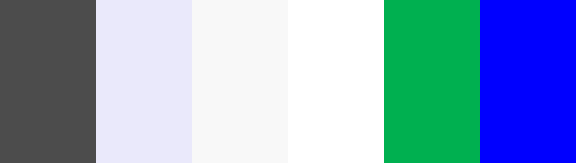
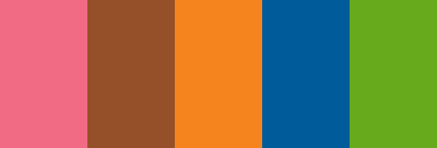

 
# **JUST GYM**

Just Gym is an elite fictional exercise gymnasium located in the heart of Devon, England.

This website provides an overview of services, class timetables, contact information and much more.

Ultimately the goal is to attract potential new clients and to provide current clients with useful information.

---
## **LIVE DEMO**

Please feel free to delve into a demo of Just Gym's website.

You can live demo Just Gym's website here: https://webslinger88.github.io/Milestone-P1/.

---

## **UX**

We're going to provide some insight into the UX process here, focusing on the important who, what and how?

Just Gym, as previously stated is an exercise gymnasium what's soul purpose is to provide an A Class service to men and women of all ages,
to achieve a healthier lifestyle and overall mindset. People of the community who're looking to keep an active, healthy lifetsyle will be
drawn to what Just Gym has to offer because of its engaging user-friendly website. Information about services, classes and contact details
can all be found on the website as well as a beautiful portfolio containing some of our much loved clients. Carry on below and read some
of Just Gym's user stories to get a feel for what people have been saying about Just Gym's new website.

---
### **USER STORIES**

> As a prospective client I want to see pictures of the gym and equipment. - Katie B.

> As a current client I think it's great that I can view the class timetable. I can even download a timetable! - Sam S.

> As a prospective client I want to be able to contact the gym easily without any fuss. - John H.

> As a current client I was drawn to the color scheme and layout of this website. - Chloe R.

---
### **STRATEGY**

* The strategy of the Just Gym website is to make important information accessible to new/existing clients while maintaining a clean and modern look.

---
### **SCOPE**

* The scope of the Just Gym website is to provide both potential clients and existing clients with necessary information which could potentially 
lead to a new member and/or providing quality information which overall makes the user happy.

---
### **STRUCTURE**

* Each page will have an identicle header and footer located at the top and bottom of the screens respectively. There are six pages in total and they
are the Home page, About page, Gallery page, Classes page, Contact page and Join page. It's a general rule that each page has at least a top banner
and a middle banner which contain titles, images, and text. The only acception is that of the Gallery page which just flows from top to bottom with
high resolution images.

---
### **SKELETON**

Just Gym's website started on a piece of paper. Sketches were drawn out and a decent design was soon ready to take a leap into the digital world.
Below you shall find some images of the original sketches used to help develop this project.

#### *Sketches*

* [Home Page sketch](assets/images/readme/home-sketch.jpg)

* [About Page sketch](assets/images/readme/about-sketch.jpg)

* [Gallery Page sketch](assets/images/readme/gallery-sketch.jpg)

* [Contact Page sketch](assets/images/readme/contact-sketch.jpg)

* [Join Page sketch](assets/images/readme/join-sketch.jpg)

After drawing up the sketches it was time to get them onto the screen. To do this I initially created a wireframe using Balsamiq Wireframes 4.
Wireframes are used to display what the creator ultimately invisions the website to look like, roughly! It acts as one of the first stepping stones
of the journey! Please find below the original Wireframes for Just Gym's project.

##### *Classes page was created after a middle project review with my mentor and design was swiftly implemented in a mock-up.*

#### *Wireframes*

* [Home Page wireframe](assets/images/readme/home-wireframe.png)

* [About Page wireframe](assets/images/readme/about-wireframe.png)

* [Gallery Page wireframe](assets/images/readme/gallery-wireframe.png)

* [Contact Page wireframe](assets/images/readme/contact-wireframe.png)

* [Join Page wireframe](assets/images/readme/join-wireframe.png)

##### *Classes page was created after a middle project review with my mentor and design was swiftly implemented in a mock-up.*

#### *Mock Ups*

Finally with the basics down on paper and screen, it was time to start shaping things up. After wireframes it's time to take things a little more
seriously. Enter Adbode XD. Adobe XD is a powerful piece of software designed to assist artists worldwide. More detailed designs have now been
concucted and sketches etc.. are now a thing of the past! If you scan down slightly you will find links to Just Gym's Mock Ups. You can clearly
see how the project has evolved and you'll also notice a new addition. A new page which wasn't initially introducted has made it's way into the picture.
The Classes page is in the mix! Check it out below.

* [Home Page Mock Up](assets/images/readme/home-mock.png)

* [About Page Mock Up](assets/images/readme/about-mock.png)

* [Gallery Page Mock Up](assets/images/readme/gallery-mock.png)

* [Classes Page Mock Up](assets/images/readme/classes-mock.png)

* [Contact Page Mock Up](assets/images/readme/contact-mock.png)

* [Join Page Mock Up](assets/images/readme/join-mock.png)

---
### **SURFACE**

The color scheme chosen for this website offers soft, subtle and neutral colors.

| **Colour name**   | **Colour RGB Code**    
| -------------     |:-------------:| 
| Custom Grey       |#4C4C4C
| Custom Blue       |#AEA9FB
| Softer Blu        |#F8F8F8
| White             |#FFFFFF
| Custom Green      |#00B050
| Blue              |#0000FF

On the classes page you will find a class timetable. The color scheme is slightly more vibrant.

| **Colour name**   | **Colour RGB Code**    
| -------------     |:-------------:| 
| Custom Pink       |#F16B84
| Custom Red        |#955029
| Custom Orange     |#F5841F
| Custom Blue       |#005B9B
| Custom Green      |#67AA1C

 * The font used throughout Just Gym's website is Google font's Rajdhani - https://fonts.google.com/specimen/Rajdhani?query=Rajdhani

 * If at any point a browser cannot support the Rajdhani font, the browser will fall back on Roboto - https://fonts.google.com/specimen/Roboto?query=roboto

---
 ## **EXISTING FEATURES**

### **NAVIGATION**

* All pages feature a top navigation bar and a footer located at the bottom. The top navigation bar includes a company
logo in the top left hand corner and adjacent to it is the company title. The right hand side of the navigation bar
features some navigation links which will direct you to other pages within the site as a whole. One awesome feature 
that is included is an animated company logo which once the page is loaded, the logo increases in size. Make sure to
look out for this! The footer contains links to important site pages: Home, Contact & Join. You'll also be able to
download a class timetable from the footer as well as find links to social media and the designers LinkedIn account.

### **Home Page**

* The Home page displays a promotion which offers 1 month free membership, it also tells people that the gym is open 24/7.
There is a large punchy slogan which catches the eye. There are equally large images which really capture attention.
Finally we are presented with the 'What we offer" section which gives users more detailed information about what Just Gym has to offer.

### **About Page**

* The About page displays a clear title at the top and we are presented with the 'Who We Are' top banner. This banner contains
a text paragraph about exactly who Just Gym are and what they're all about and an attractive image to sit beside.

* Moving down to the middle banner we are presented with the 'What We Do' section of the page. Here Just Gym describes exactly what they
do and why they do it. You'll find information about classes, friendship and even diet! Keep a look out for high resolution images
and informative text layed out in a kind of staggered effect.

### **Gallery Page**

* The Gallery page has its clear title located at the top. It is built up of thirteen separate high resolution images of varying sizes nested in
some rather attractive hoverable thumbnails. You can click on the images and they will increase to fullscreen size in a spearate tab. You can
zoom into these images to really get a scope of the place!

### **Classes Page**
 
 * The Classes page has its clear title located at the top as you'd expect following suit from previous pages. Below the title within the top 
 banner you find yet another punchy slogan as well as some inspirational text and some high quality images. Yes we're all about high quality
 photography at Just Gym! You'll also find a handy little link to the Join page planted into the text paragraph there.

 * Moving down to the middle banner you'll find a vibrant somewhat attractive indication of what classes Just Gym have to offer.
 There are five classes on offer: Spin, HIIT, Yoga, LBT & Pump. There below you'll see text urging the user to choose a class.

 * Finally at the bottom banner we have a grid. This grid is Just Gym's class timetable. There is a column for the days of the week and there are
 columns for each one of the classes each labelled with the class name, time and instructor. This is the grid that is available for download in
 the footer.

 ### **Contact Page**

 * The Contact page starts with it's clear title at the top. Below this you shall find within the top banner an image depicting the different forms 
 of communication. Adjacent to this is a text paragraph to the user giving detailed information.

 * Moving down to the middle banner you'll find an image of a woman with headphones on which hints to the idea that there will always be someone to
 help on the other end of the line. Adjacent to this is Just Gym's contact form. The contact form is quite simplistic and therefore user friendly.
 There are three initial fields to fill in: Name, E-mail and Phone. Below this there is a dropdown box which asks the user to choose an option.
 There are hour options to choose from: Feedback, Classes, Personal Training and Opening Times. Below this there is a resizable text box where the
 user can easily type out a message. Beneath there is a neat little button to click which gives the user the opportunity to have the whole message
 sent to their e-mail address. finally below that you'll find the 'Send' button and some social links.

 ##### *Currently there is no Java Script coded into this website therefore there currently isn't the capability to send e-mails or recieve notifications for sent mails.his will be a feature which will be implemented in the near future. For now a Modal has been set up in place of this and a notification will appear when the 'Send' button is clicked. Unfortunately this has disabled the required fields so for the time being, it is possible to click the 'Send' button without actually filling out any fields. The implenentation of Java Script will also enable e-mails to be copied and sent to their owner. Curently the buttons for this form are purely aesthetic.*

* Finally at the bottom you will find an embedded Google Map which shows the location of Just Gym's fictional establishment. Underneath the embedded Google Map
you can find the company's address and telephone number.

##### *Because Google Map's embedded map is beyond the scope of Code Institute's Milestone Project 1, the scaling and dimensions of the map are a little off, especially when presented in Mobile View. Perfect coding for this feature will be implemented in the near future.*

 ### **Join Page**

 * Differently to the other pages, the Join page does away with the clear title at the top and instead it jumps straight into a large catchy slogan on the right
and a promotional offer on the left. Below the slogan and promotion there is a clear high resolution image of two women connecting on a laptop computer and a 
mobile telephone device. This shows users that they are in the right place to join up. Opposite is a few words of wisdom for you to digest. This takes us to the
bottom banner where we are issued with a notice stating that Just Gym is currently closed due to unforseen circumstances. You will find viral images colored in red
along with a bold red title and a nice portion of text. Within this text is a link to Just Gym's Contact page and also a link to the NHS website which will offer
important advice regarding the current world situation.

##### *In the near future Just Gym's Join page will do away with the current alert and shall be replaced with a Join Now form. Here users will be able to enter their Name, Age, Sexual Orientation etc.. and they'll also be able to choose which membership package they wish to employ.*

---

 ## **FEATURES LEFT TO IMPLEMENT**

 * As mentioned above the contact us form has little to no action. No e-mail gets sent when the 'Send' button is clicked. The idea is to have e-mails sent
 automatically to Just Gym staff when the user submits the form. E-mails also need to be copied and sent to the user when the 'copy' button is clicked.

 * At the moment there is a Modal in place so that when the 'Send' button is clicked the user is presented with a message informing them that their message
 has indeed been sent. Unfortunately this has temporarily disabled the ability to set all text fields to 'Required'. At this point in time, anyone can submit
 a form without filling out the necessary fields. This will be fixed in time so that a proper notification message appears and all relevant fields are set to
 'Required'. This will be implemented through further learning.

 * Also mentioned above is the stability of the embedded Google map. This is currently being worked on and in the near future the site will have a Google map
 that is positioned correctly, responsive and ready to server its full purpose. This will be implemented through further learning.

* The Join page will soon enough be a full operational Sign Up form. All gyms across the United Kingdom are currently closed due to a worldwide virus outbreak.
When the sanctions against the British public have been lifted then a form shall be put in place for users to fill in. Here users will be able to enter their 
Name, Age, Sexual Orientation etc.. and they'll also be able to choose which membership package they wish to employ.

 ---

  ## **TECHNOLOGIES USED**

1. HTML5

    * The building blocks to everything that is code! Used in Gitpod to create the foundations of Just Gym

2. CSS3

    * Who's got style? Used in Gitpod to style Just Gym's HTML code.

3. [Bootstrap v4.4.1](https://getbootstrap.com/)

    * Used for navigation bars, Bootstrap's grid system, forms and mobile responsiveness.

4. [Font Awesome](https://fontawesome.com/start)

    * Used to provide quality icons for use within Just Gym's whole website.

5. [JavaScript](https://getbootstrap.com/docs/4.5/getting-started/introduction/)

    * Briefly used in order for Just Gym's contact form to display a Modal message.
    
6. [Google Fonts](https://fonts.google.com/)

    * Used to change the font throughout Just Gym's whole website.

7. [Hover.css](https://ianlunn.github.io/Hover/)

    * Used to provide animation to select icons.

8. [Balsamiq Wireframes 4](https://balsamiq.com/)

    * Used to create Just Gym's Wireframes.

8. [Adobe XD](https://www.adobe.com/uk/products/xd.html)

    * Used to create Just Gym's Mock Ups, Class Timetable PDF and select .png and .jpg files.

    ---

## **TESTING**

### **HEADER**

The website can be navigated using the navigation links at the top right hand side of the navigation bar. Each link has been tested across all pages and each link 
takes you to the correct page. The Just Gym logo and title both act as links back to the Home Page. The Just Gym logo also includes a @keyframes hero-zoom which
implements a transform scale css code. Basically the image starts small and over the course of five seconds the image increases in size. This has been tested and is 
true across all Just Gym web pages. When a user hovers their mouse over one of the navigation links, each link hovers down to emphasize exactly where the mouse is 
pointing. This has been tested and is true across all Just Gym web pages. Each navigation link is paired with a Font Awesome icon. Depending on which page you are 
currently on, the Font Awesome icon next to the link text will show as blue instead of the usual grey. This indicates to users which page they are currently on. 
In addition to this, the current page's navigation link will also have underlined text. As before, this has been tested and is true across all Just Gym web pages.
The header acts responsively across all resolutions.

### **HOME PAGE**

The user is presented with a landing page (Home page). All images and text are central. There is a 'Join Now' button in the top banner which when clicked diverts the user
to the Join page. This works perfectly. At the bottom right hand side of the screen there is a 'Back to top?' line of text with a Font Awesome arrow icon. When a user 
hovers their mouse over the icon it pulsates upwards. When a user clicks on the link they are directed back to the top of the page. When the Home page drops its resolution
to small sized screens, the 'What We Offer' image is split into four separate images so that the text is easier to read on smaller devices. The Home page acts responsively 
across all resolutions.

### **ABOUT PAGE**

The user is presented with the About page. All images and text are central. At the bottom right hand side of the screen there is a 'Back to top?' line of text with a Font 
Awesome arrow icon. When a user hovers their mouse over the icon it pulsates upwards. When a user clicks on the link they are directed back to the top of the page. When the 
About page drops its resolution to small sized screens, the 'connect-img' depicting two friends talking has been blocked from view because it wasn't aesthetically pleasing
to the eye. The Home page acts responsively across all resolutions.

### **GALLERY PAGE**

The user is presented with the Gallery page. All images are parallel with perfect padding. Each image is nested in a thumbnail. When a user's mouse hovers over the thumbnail
a shadow border appears around the image. This makes it easy for the user to distinguish which image they are targeting. When a user clicks on an image a new tab is opened and 
a high resolution image is presented. The user can then zoom in and/or save/print the image. All images have been tested and this is true for all images. At the bottom right 
hand side of the screen there is a 'Back to top?' line of text with a Font Awesome arrow icon. When a user hovers their mouse over the icon it pulsates upwards. When a user 
clicks on the link they are directed back to the top of the page. When the Gallery page drops its resolution to small sized screens, instead of the images being presented in
two columns they are now presented in one single column. This makes it easier for users to view the images on a mobile device. The Gallery page acts responsively across all 
resolutions.

### **CLASSES PAGE**

The user is presented with the Classes page. All images and text are central. Everything is parallel and as it should be. There is a paragraph on the right hand side of the
screen, this paragraph contains some bold text stating 'get in touch!'. This text is actually a link to the Contact page. When a user clicks this link they are directed to 
the Contact page. The link works as expected. When a user hovers over this link, it activates a shadow effect on the text which gives the effect of the text being more bold.
At the bottom right hand side of the screen there is a 'Back to top?' line of text with a Font Awesome arrow icon. When a user hovers their mouse over the icon it pulsates 
upwards. When a user clicks on the link they are directed back to the top of the page. The Classes page acts responsively across all resolutions.

### **CONTACT PAGE**

The user is presented with the Contact page. To the right side of the middle banner there is a contact form. This form consists of five text fields and one button and a check-box. 
Firstly each text field has the ability to be written in. There is HTML code that is in place to make sure the Name, E-mail and Subject fields are 'required'. Unfortunately this code
is ignored due to the fact that a key piece of code has been removed. The 'Send' button's type has been changed from type="submit" to type="button". This is because the developer
thought it was best to include a Modal feature when the 'Send' button is clicked. This Modal will appear to inform the user that their message has been sent. The developer
did this because it was best to have a functional button rather than an inactive button. No actual e-mail is sent when the 'Send' button is clicked. There is also a 'Send me a
copy of this message' check-box under the form. When clicked the box is filled with a tick and the color green. This has been tested and works perfectly, although no actual e-mail
is sent. This has been discussed in *FEATURES LEFT TO IMPLEMENT* and a plan is in place to correct the issue. Below the contact form are four Font Awesome icons. These icons act 
in the same way as the Footer icons. They change color when interracted with and they direct you to four different social media sites: Facebook, Twitter, LinkedIn and Instagram.
Each link has been tested and each link takes you to the correct page. Loacted in the bottom banner the user will find an embedded Google Map image. This is an interactive map
that lets you move it around. The map isn't perfect because the bottom of it is slightly cropped out. The map also isn't 100% responsive. This has been discussed in *FEATURES LEFT 
TO IMPLEMENT* and a plan is in place to correct the issue. At the bottom right hand side of the screen there is a 'Back to top?' line of text with a Font Awesome arrow icon. When a 
user hovers their mouse over the icon it pulsates upwards. When a user clicks on the link they are directed back to the top of the page. The Classes page acts responsively across 
all resolutions apart from the mentioned Google Map.

### **JOIN PAGE**

The user is presented with the Join page. There are only really three major things to test on the Join page if you ignore the Header and Footer. Located in the Corona banner (bottom
banner) there are two links nested within the paragraph text. The first is a Contact Us link. This a link to the Contact page. When a user clicks this link they are directed to the 
Contact page. The link works as expected. When a user hovers over this link, it activates a shadow effect on the text which gives the effect of the text being more bold. The second 
link is a Font Awesome icon. The link icon changes color when you hover over it. Similar to before the icon pulsates while it has interraction. Clicking the link will open up a new 
tab in the user's browser and is presented with the NHS website. This has been tried and tested, everything works well. At the bottom right hand side of the screen there is a 'Back 
to top?' line of text with a Font Awesome arrow icon. When a user hovers their mouse over the icon it pulsates upwards. When a user clicks on the link they are directed back to the 
top of the page. The Classes page acts responsively across all resolutions.

### **FOOTER**

Similar to the Header, the Footer also has navigation links. These links are Home, Contact and Join. They are located to the left hand side of the Footer. Each link 
has been tested across all Just Gym web pages and each link navigates you to the correct page. Each of these links increase in size slightly when a user hovers their #
mouse over the link. There are also Font Awesome icons here which pulsate when they're interacted with. This has been tested and is true across all Just Gym web pages. 
To the right of the navigation links users will find some text indicating that you're able to download a printable Just Gym class timetable. The download link is again
a Font Awesome icon which changed color as you hover over it. Similar to before the icon pulsates while it has interraction. Clicking the link will open up a new tab in
the user's browser and is presented with a printable PDF file. This has also been tested across all pages. Moving to the right again the user will find links to social
media. Keeping to the theme, the links are also Font Awesome icons which change color and pulsate when interracted with. When clicked, each link opens a new tab and directs
the user to one of four possible home pages: Facebook, Instagram, Twitter and Youtube. All links have been tested across all pages and everything works as expected. Finally
on the far right hand side the user will find a small line of text which contains a link to Just Gym's web developer's LinkedIn profile. When a user hovers over this link,
it activates a shadow effect on the text which gives the effect of the text being more bold. This has been tested and is true across all Just Gym web pages. The header acts 
responsively across all resolutions.

### **DISPLAY TESTING**

The Just Gym website has been tested using (all on 18" Dell XPS with Windows 10 + on an external 30" display):

* Google Chrome Version 81.0.4044.138 (Official Build) (64-bit)
* Firefox Version 76.0
* Opera Version 67.0.3575.137
* Safari Version 13.1
* Edge on Windows 10 Version 81.0.416.72
* Google Chrome on Android (Samsung Galaxy S8+) 81.0.4044.138
* Safari on iOS 13.4.1 (Apple iPhone 7 Plus)
* Internet Explorer 10 - via https://www.ieonchrome.com/
* Internet Explorer 11 - via https://www.ieonchrome.com/

### **CODE VALIDATION**

The website's CSS code has been tested for irrelevant code using the Chrome Developer Tool 'Coverage'.
Several lines of unused code was identified and subsequently removed during this process.

The website has also been tested via the [W3C Markup Validation Service](https://validator.w3.org/) & [W3C CSS Validation Service](https://jigsaw.w3.org/css-validator/).

* One error appeared using the W3C Markup Validation Service. A single < span > element needed to be removed from the footer across all pages.
* There were no errors at all using the W3C CSS Validation Service.

---

## **DEPLOYMENT**

---

## **CREDITS**

Various websites were used in order for Just Gym's website to become what it is today. All content displayed is part of the public domain.

### **CONTENT**

* All textual content on the Just Gym website was written by Lewis Wheeler - Just Gym's Full Stack Web Developer.

### **MEDIA**

* Imagery:

    * [Pxhere](https://pxhere.com/)
    * [Pexels](https://www.pexels.com/)
    * [Unsplash](https://unsplash.com/)
    * [Pixabay](https://pixabay.com/)
    * [PNG Guru](https://www.pngguru.com/)
    * [Google Images](https://www.google.co.uk/imghp?hl=en&tab=wi&ogbl)

---

### **ACKNOWLEDGEMENTS**

Inspiration was used is various locations across the world wide web. Please see below some of the key sources used to help develop Just Gym.

* Gallery - [Template](https://bootsnipp.com/snippets/p1qAD)

    * This gallery template was used to help form the foundations of Just Gym's Gallery page. - [Bootsnipp](https://bootsnipp.com/)

* Gallery - [Thumbnails](https://www.w3schools.com/howto/tryit.asp?filename=tryhow_css_thumbnail_image)

    * Thumbnails for the Gallery images were brought to life with the help of this code. - [W3Schools](https://www.w3schools.com/)

* Contact - [Modal](https://getbootstrap.com/docs/4.4/components/modal/)

    * The base code to create a modal was taken from Bootstrap's extensive library. - [Bootstrap](https://getbootstrap.com/)

* Contact - [Form](https://mdbootstrap.com/docs/jquery/forms/basic/)

    * The base code to create a contact form was taken from MDBootstrap's extensive library. - [MDBootstrap](https://mdbootstrap.com/)

* Contact - [Google Maps](https://www.youtube.com/watch?v=LoOb3jSnEw0&feature=youtu.be)

    * Tutorial on how to embed Google Maps by Jahra Jarin. - [Youtube](https://www.youtube.com)

*A special thank you to Maranatha Code Institute Mentor and Claire Code Instutite Tutor for aid and assistance* 